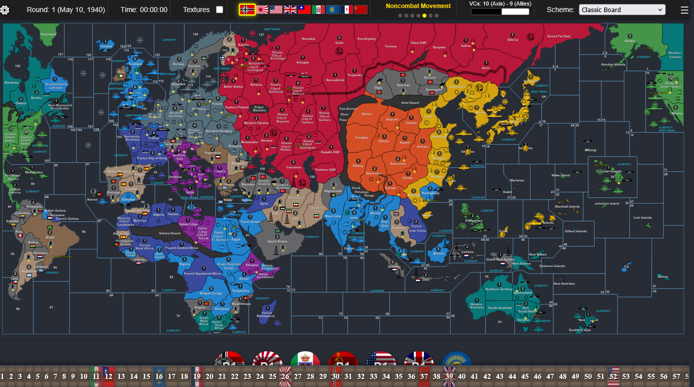
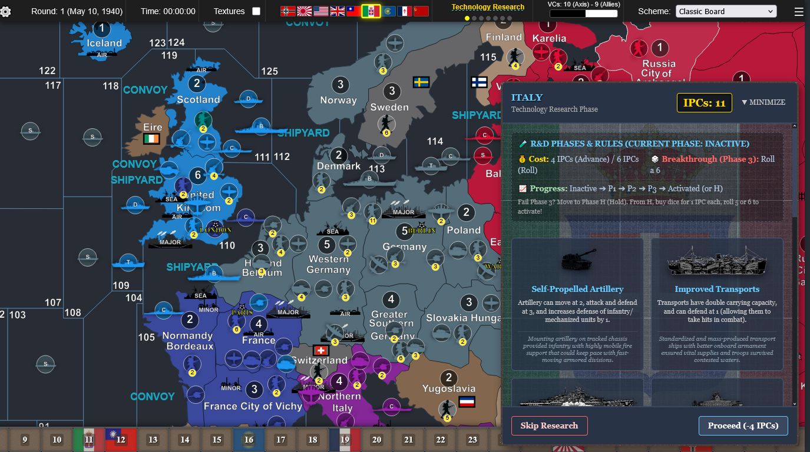
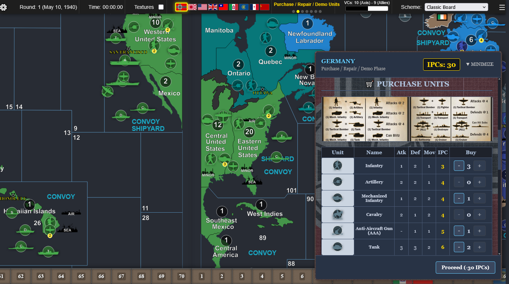
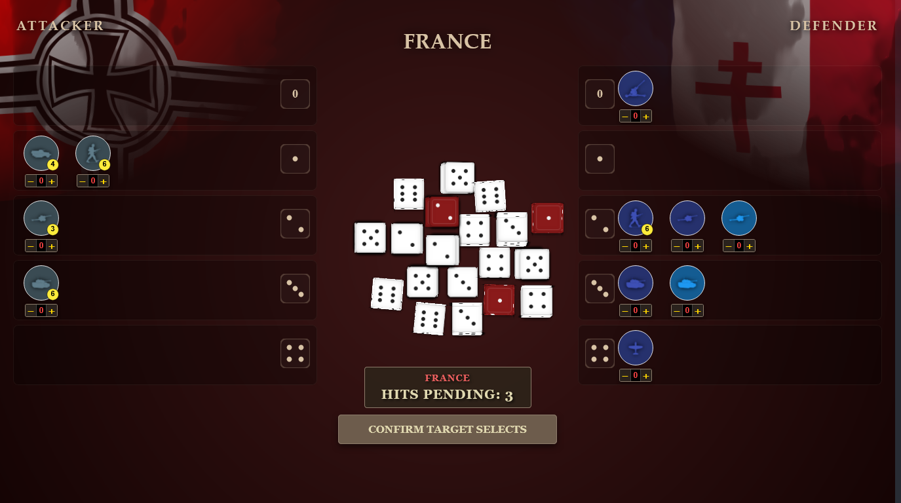
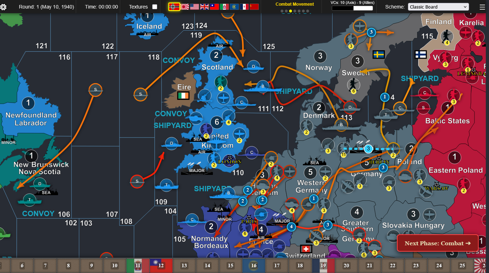
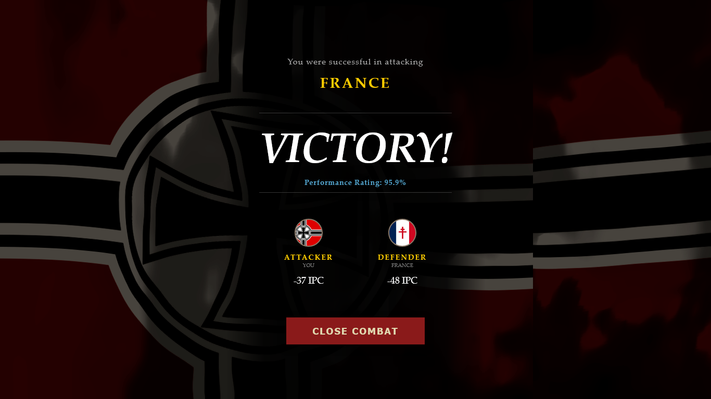
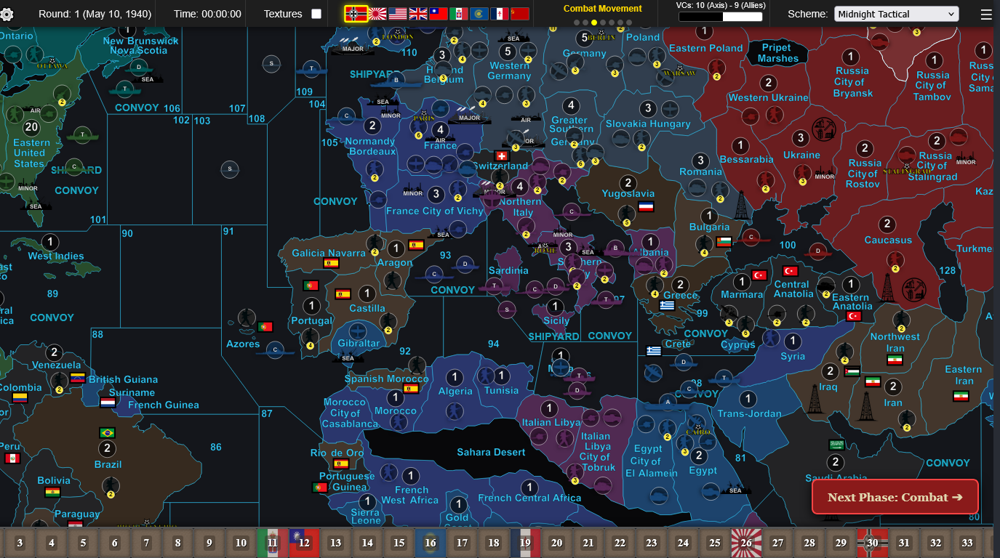
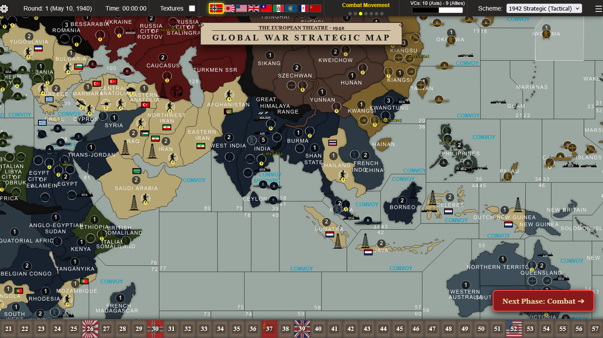
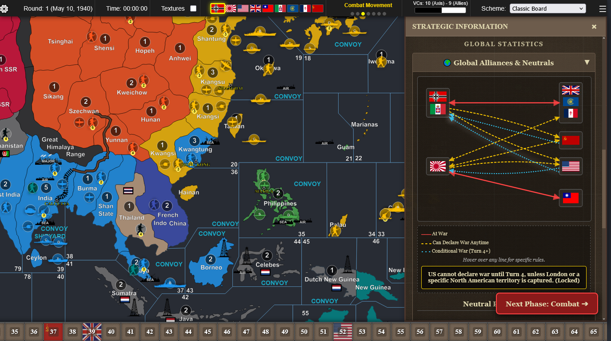
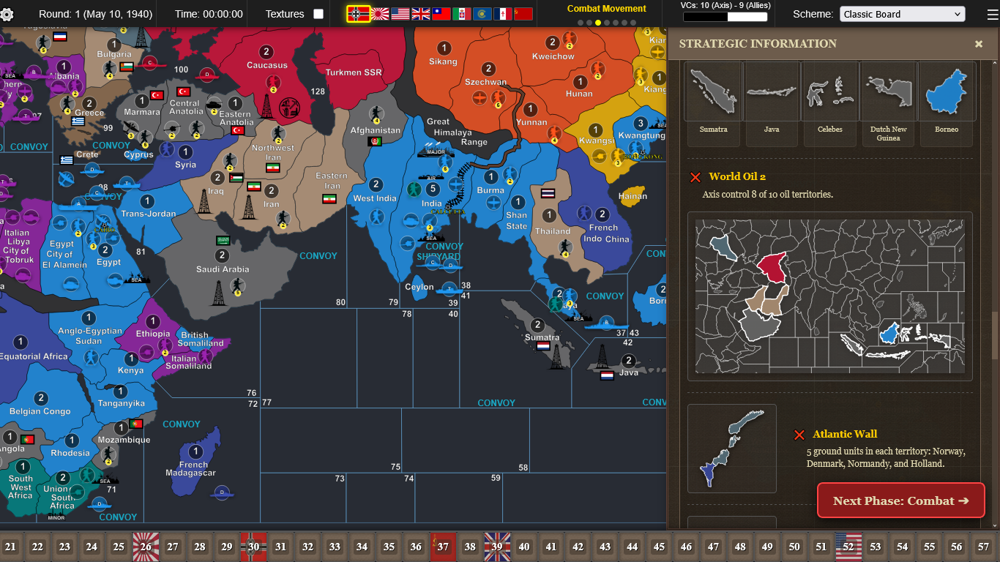

# Global War Strategic Map

An interactive, browser-based strategy board game simulator modeled after *Axis & Allies* utilizing Blood Bath Rules (BBR) mechanics. This application features dynamic map rendering, complex political alignment tracking, automated national objectives, a built-in battle simulator, and path-based unit routing.

This project is currently under active construction. Future development plans include integrating a custom-trained AI to support single-player offline play.

[**Live Demo (GitHub Pages)**](https://lumino-cipher.github.io/map/)

---

## Technical Overview & Features

### 1. What It Is
This application serves as an interactive sandbox and utility suite for BBR-style grand strategy gaming:
* **Dynamic SVG Map:** Rendered entirely via inline vector graphics with multiple real-time color schemes (including Classic Board, Midnight Tactical, and 1942 Strategic).
* **Automated Rules Engine:** Tracks complex, turn-based national objectives, income levels (1-70 IPC track), and global alliance shifts based on board state.
* **Path-Based Unit Routing:** Implements mathematical pathing and Catmull-Rom spline curves to draw tactical movement arrows across shared territory borders.
* **Built-In Battle Simulator:** Runs localized Monte Carlo simulations (up to 1,000 iterations) to predict combat probabilities, average IPC losses, and survival distributions based on custom casualty-priority orders.
* **Cinematic 3D Visuals:** Employs WebGL (Three.js) shaders to render realistic waving flags and physical 3D dice drops in real-time during combat resolution.

### 2. Technical Architecture & Stack
To maintain low latency and eliminate load-time overhead, this application is designed with a lightweight, client-side first architecture:
* **Core Stack:** Vanilla HTML5, CSS3, and JavaScript.
* **WebGL rendering:** Three.js is utilized specifically for the 3D dice and dynamic flag shaders.
* **Dynamic SVG Manipulation:** All board territories, visual borders, and unit counters are manipulated directly inside the DOM to maintain sharp scaling across different zoom levels.
* **Data Layer (JSON):** Powered by approximately 2MB of custom-designed configuration files detailing coordinate grids, unit profiles, waypoint paths, and logical adjacencies.
* **Codebase Structure:** The primary execution logic, rendering pipelines, and state machines are managed in a unified frontend script of approximately 13,000 lines (`index.html`).

---

## Project Motivation (Why I Built It)

While this began primarily as a personal hobby and passion project, it also served as an exercise to solve several front-end and algorithmic challenges:
* **High-Performance Vector Graphics:** Exploring how to scale, scroll, and drag thousands of vector elements seamlessly across a very large viewport without the memory overhead of a heavy canvas framework.
* **State Machine Complexity:** Managing deep, multi-phase local game states (Technology ➔ Purchase ➔ Combat Move ➔ Conduct Combat ➔ Noncombat ➔ Mobilize ➔ Collect Income) with rollbacks and transactional validations.
* **Vector Pathfinding & Geometry:** Resolving adjacent-boundary intersections programmatically to generate logical paths, waypoint offsets, and avoid overlapping visual elements on small map islands.

---

## UI Screenshots

### Main Strategic Map & Unit Placement
*The main view displays detailed unit placement, custom map color schemes, and real-time strategic information panels.*



### Purchase & Repair Phase Window
*Manage production queues, repairs, and industrial complexes dynamically during the purchase phase.*

### Technology Research Phase Window
*The "Technology Research" phase menu for Italy. The window details rules, progression phases, and breakthrough mechanics, with selectable cards for active projects like Self-Propelled Artillery and Improved Transports.*





### Combat Resolution & WebGL Dice
*A close-up of the dynamic combat screen showcasing custom target selection, WebGL dice simulations, and structural casualty assignment.*



### Combat Movement Phase
*The Western Europe and North Atlantic region during the "Combat Movement" phase. Curved movement arrows map complex naval interceptions, airborne drop vectors, and multi-national ground movements in preparation for combat.*



### Victory Screen & Statistics
*Review detailed statistics, performance ratings, and IPC loss calculations at the close of an engagement.*



### Map Schemes
*The European theater rendered in the high-contrast "Midnight Tactical" color scheme. The visual layer displays deep dark naval zones, custom political borders, and multi-colored pathing vectors illustrating planned noncombat aircraft routes.*



*The Asian and Pacific theater rendered under the "1942 Strategic (Tactical)" vintage parchment scheme. This layout displays an antique aesthetic, customized muted power fills, and a stylized strategic title banner at the top.*



### Diplomacy and Dependency
*The "Global Alliances & Neutrals" interactive diplomacy diagram housed in the right-hand strategic panel. Hovering or clicking on relational vectors highlights specific entry conditions, restrictions, and political treaties.*



### Strategic Victory Objectives
*The "Victory Conditions" accordion panel displaying tracking statuses for objectives like "World Oil 2" and "Atlantic Wall." It dynamically generates and overlays context-aware mini-maps inside the sidebar.*



---

## How to Run the Project

### Method 1: Play in the Browser (Recommended)
You can run the game immediately without installing anything by visiting the GitHub Pages link:
👉 **[https://lumino-cipher.github.io/map/](https://lumino-cipher.github.io/map/)**

### Method 2: Run Locally
Because the application fetches local config assets (such as `labels.json`, `setup.json`, and `neutral.json`) via asynchronous JavaScript (`fetch`), browser security models require running it via a local web server rather than opening `index.html` directly as a file.

1. Clone this repository to your local machine:
   ```bash
   git clone https://github.com/Lumino-Cipher/map.git
   cd map
   ```
2. Start a simple local server. For example, if you have Python installed, run:
   ```bash
   # Python 3
   python -m http.server 8000
   ```
   Or if you use Node.js:
   ```bash
   npm install -g local-server
   local-server
   ```
3. Open your browser and navigate to `http://localhost:8000`.